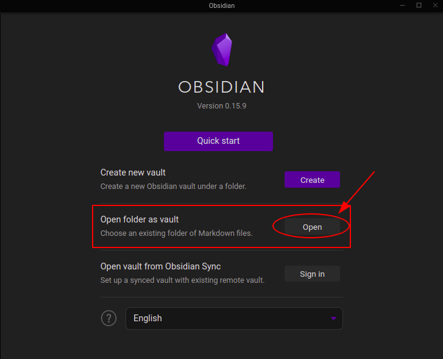
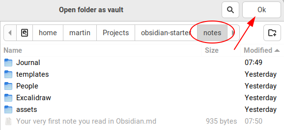
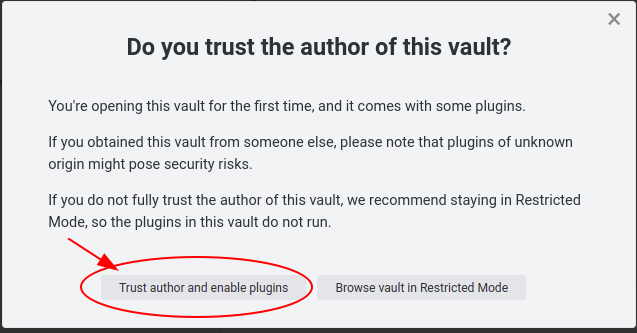
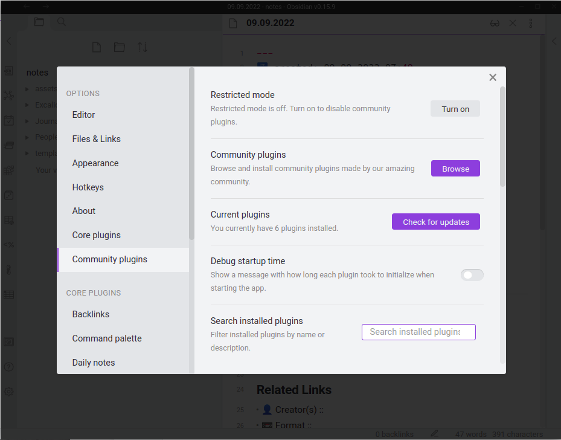
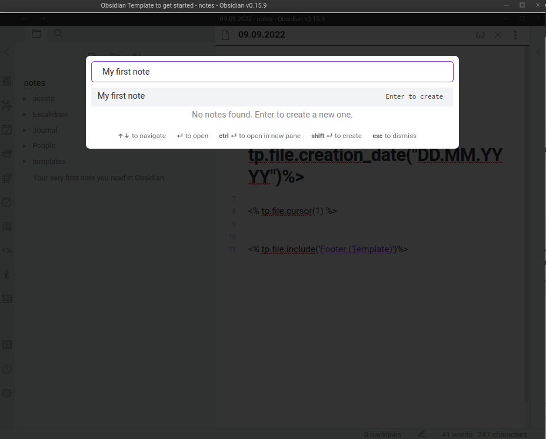
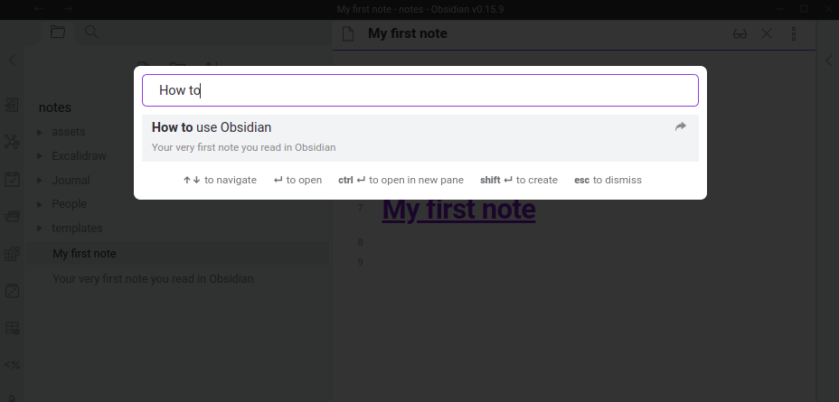

# Obsidian Starter Project
Gets you started with the note taking App Obsidian!

Official **Obsidian** Documentation:
🔗 URL :: https://help.obsidian.md/Obsidian/Index

## Getting started with Obsidian
1. **Clone** this repository:: `git clone git@github.com:zwoefler/Obsidian-Starter.git`
2. **Install** [Obsidian](https://obsidian.md/download) for:
	1. [**Windows**](https://github.com/obsidianmd/obsidian-releases/releases/download/v0.15.9/Obsidian.0.15.9.exe)
	2. [**Mac** (Universial DMG)](https://github.com/obsidianmd/obsidian-releases/releases/download/v0.15.9/Obsidian-0.15.9-universal.dmg)
	3. **Linux**:: (On Ubuntu, run the `./install_obsidian_ubuntu_appimage.sh` script)
		1. [AppImage](https://github.com/obsidianmd/obsidian-releases/releases/download/v0.15.9/Obsidian-0.15.9.AppImage)
		2. [Snap](https://github.com/obsidianmd/obsidian-releases/releases/download/v0.15.9/obsidian_0.15.9_amd64.snap)
3. **Open** Obsidian
4. Click **Open folder as vault** and choose the **location** of the **`/notes`** folder from this repo
 
5. **Click** `Trust author and enable plugins` (Enables Plugins) 
6. Hit **ESC** to close the Settings popup 
7. Hit **CTRL + O**, type "My first note" and hit **ENTER** 

🥳 You have successfully created your first note!

## 🚀 Start using Obsidian
Open the "How to use Obsidian note in Obsidian" using the Quickswitcher
1. **CTRL + O**
2. Type "How to" and hit **ENTER**
3. Read the note, get started and have fun!

## ⌨️ Basic Hotkeys
- CTRL + O :: **Quickswitcher**, lets you find files
- CTRL + P :: **Command Palette**, execute commands
- CTRL + W :: **Closes current note**
- ALT + E  :: **Include Template**

## What the template includes
### Templater
A basic template that moves files that start with an `@` into the `People` folder.

Hitting **ALT + E** will open the templater menu.
A few basic templates such as
- `Source (Template)`
- `Link (Template)`
- `Origin (Template)`
can be imported and used to save valuable time writing notes.

The templater is a powerful tool, as you can create your own templates.

**Templater Plugin Documentation**
🔗 URL:: https://silentvoid13.github.io/Templater/

### 📅 Daily notes / Journal
Every day a new note with the current day is created and opened as the default note

### 🗒️ Footnotes
Hitting **CTRL + SHIFT + ^** will include a Footnote at the bottom of the note.
Hitting **CTRL + SHIFT + ^** again will jump back to the text

## 💡 Tips
- Write notes in your own words
- When you find yourself writing the same thing twice, try automating it with a template!
- Include Links (URL) as sources for your knowledge

## 🚧 Some remarks
Obsidian works great for me, but may not work for you!
Many things can be automated via Javascript or existing Plugins.
You can build templates, copy your folder structure and so on.
Obsidian is text based, and so should be your knowledge. If you find yourself working with lots of images, code

However some people find it overwhelming. And that is fine!

Obsidian might **not** be for you when:
- You only write short shopping lists
- Already have a working note taking solution
- Don't like to work with Markdown
- Need a good mobile App

### Installed Plugins
- **Advanced Tables**:: Helps you out with tables
- **Excalidraw**:: Let's your create simple drwaings
- **Footnote Shortcut**:: Create footnotes
- **Obsidian Charts**:: Create simple charts
- **Templater**:: Allows for complex templates
- **Tidy Footnotes**:: Sorts Footnotes

## 🔗 Official Links

**obsidian-releases**. Official GitHUb Repository to contribute themes and plugins.
**Not** the source code!
🔗 URL :: https://github.com/obsidianmd/obsidian-releases

# 🛠️ ToDOs
- [ ] How to delete Obsidian?
- [ ] Script to sync Obsidian to private GitHub Repository
- [ ] Documentation to Plugins and functions in GitHub (git remote set-url)
- [ ] How to get your notes from Google-Keep to Markdown / into Obsidian
